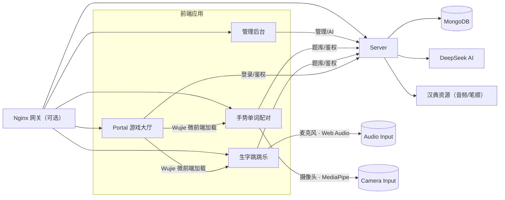

# LexiPlay 字词互动学习平台 Monorepo

一个面向字词学习的多感官互动平台：以“游戏大厅 + 子游戏 + 管理后台 + API 服务”的方式组织，支持语音驱动的汉字弹跳游戏与手势驱动的单词配对游戏，并提供 AI 辅助题库录入。

> 说明：项目历史上以“bouncyballs”命名，部分路由/部署路径仍保留 `bouncy-balls` 作为兼容标识。

## 1. 项目定位

- 面向人群：小学汉字启蒙、基础英语词汇学习者
- 目标：用“语音 + 手势 + 物理互动”降低学习门槛、提升趣味性
- 形式：游戏大厅统一入口 + 多子游戏加载 + 后台题库管理 + AI 自动生成

## 2. 功能总览

- 游戏大厅（Portal）
  - 玩家注册/登录
  - 游戏卡片与入口
  - 统一承载子游戏（微前端）
- 子游戏 1：生字跳跳乐（Client）
  - 麦克风音量驱动小球弹跳
  - 汉字详情展示：拼音、组词、音频、笔顺
- 子游戏 2：手势单词配对（Gesture Word Match）
  - 摄像头 + 手势识别拖拽卡片
  - 英文 → 中文配对、计时与准确率
- 管理后台（Admin）
  - 汉字题库管理
  - 单词题库管理
  - AI 批量生成 + 人工审核
- 后端服务（Server）
  - 认证、题库 CRUD
  - AI 补全与媒体资源获取
  - Nginx 网关鉴权接口

## 3. 系统架构



## 4. 关键流程

### 4.1 登录与鉴权

1. 玩家在 Portal 登录，后端签发 JWT
2. Portal 保存 `playerToken`（localStorage）并下发 `portalToken`（HttpOnly Cookie）
3. 子游戏在生产环境启动时调用 `/api/portal/auth/verify` 校验
4. Nginx 可通过 `auth_request` 调用 `/api/portal/auth/nginx-verify` 做网关拦截

### 4.2 子游戏加载（微前端）

- Portal 使用 `wujie-react` 加载子游戏
- 通过 props 传入 `token / user / closeLoading`
- 子游戏 `gameId` 对应路由：
  - `bouncy-balls` → 生字跳跳乐
  - `gesture-word-match` → 手势单词配对

### 4.3 题库与 AI 流转

- Admin 录入题库 → 存入 MongoDB
- AI 生成：
  - 汉字：DeepSeek 生成拼音与组词，同时拉取汉典音频/笔顺图
  - 单词：DeepSeek 生成中英词对，支持分类与难度
- 子游戏按需拉取题库（支持随机抽题）

## 5. 数据模型与内容结构

### 5.1 Character（汉字）

- `char`：单个汉字
- `pinyin`：带声调拼音
- `examples`：1-3 个组词
- `audio`：汉字读音（Base64）
- `stroke`：笔顺 GIF（Base64）

### 5.2 WordPair（单词）

- `en`：英文单词或短语
- `zh`：中文释义
- `category`：分类（如 `food / animal / nature`）
- `difficulty`：难度（`easy / medium / hard`）
- `image`：单词配图（Base64，可为空）

### 5.3 User（用户）

- `username`
- `password`（bcrypt 哈希）

## 6. 仓库结构

```text
lexiplay-monorepo
├─ apps
│  ├─ server              # Node.js + Express + MongoDB API
│  ├─ portal              # 游戏大厅（主应用）
│  ├─ client              # 生字跳跳乐（语音驱动）
│  ├─ gesture-word-match  # 手势单词配对（手势驱动）
│  └─ admin               # 管理后台（题库管理）
├─ deploy                 # 部署脚本与 Nginx 配置示例
├─ package.json
└─ pnpm-workspace.yaml
```

## 7. 子项目实现要点

### 7.1 Portal（游戏大厅）

- React + Vite + Ant Design + Wujie
- 统一登录/注册、游戏入口与子应用承载
- 通过 `GameViewer` 统一处理子应用全屏/刷新/加载态

### 7.2 Client（生字跳跳乐）

- Matter.js 物理引擎模拟弹跳
- Web Audio API 读取麦克风音量 → 影响弹跳强度
- 支持汉字详情卡（拼音、组词、音频、笔顺）

### 7.3 Gesture Word Match（手势单词配对）

- MediaPipe Hand Landmarker 识别手势
- 拳握/松开驱动拖拽卡片配对
- 支持计时、准确率、重开
- 通过 `public/mediapipe` 与 `public/models` 预置 WASM 与模型，便于离线运行

### 7.4 Admin（管理后台）

- 汉字题库：支持单条录入、批量 AI 生成、音频/笔顺预览
- 单词题库：支持导入/导出、难度与分类、AI 生成与审核
- 登录态存储在 `localStorage.adminToken`

### 7.5 Server（后端 API）

- JWT 鉴权（Portal/Admin 分应用域）
- MongoDB 存储题库与用户
- DeepSeek AI 辅助生成
- 汉字音频/笔顺资源自动拉取（汉典）

## 8. 主要 API（摘要）

认证：

- `POST /api/admin/auth/register`
- `POST /api/admin/auth/login`
- `GET /api/admin/auth/verify`
- `POST /api/portal/auth/register`
- `POST /api/portal/auth/login`
- `GET /api/portal/auth/verify`
- `POST /api/portal/auth/logout`
- `GET /api/portal/auth/nginx-verify`

汉字题库：

- `GET /api/characters?page=1&limit=20`
- `POST /api/characters`
- `PUT /api/characters/:id`
- `DELETE /api/characters/:id`
- `GET /api/characters/export`

单词题库：

- `GET /api/word-pairs?random=true&count=5`
- `GET /api/word-pairs?page=1&limit=20&keyword=...`
- `POST /api/word-pairs`
- `PUT /api/word-pairs/:id`
- `DELETE /api/word-pairs/:id`
- `GET /api/word-pairs/export`
- `POST /api/word-pairs/batch-import`

AI：

- `GET /api/ai-generate?char=汉`
- `POST /api/ai-generate-characters`
- `GET /api/ai-generate-word?word=apple`
- `POST /api/ai-generate-word-pairs`

## 9. 环境要求

- Node.js 18+
- pnpm 8+
- MongoDB 6+

## 10. 环境变量

### 10.1 Server（apps/server）

`NODE_ENV=development` → `.env.development` ；`NODE_ENV=production` → `.env.production`

```bash
PORT=3000
MONGO_HOST=127.0.0.1
MONGO_PORT=27017
MONGO_DB=bouncyballs
MONGO_USER=
MONGO_PASS=
MONGO_AUTH_SOURCE=admin
JWT_SECRET=replace_me
DEEPSEEK_API_KEY=replace_me
CORS_ORIGINS=http://localhost:3001,http://localhost:3002,http://localhost:3003,http://localhost:3004
```

### 10.2 Portal（apps/portal）

```bash
VITE_BOUNCY_BALLS_URL=/bouncy-balls/
VITE_GESTURE_WORD_MATCH_URL=/gesture-word-match/
VITE_API_PROXY_TARGET=http://localhost:3000
```

### 10.3 Client（apps/client）

```bash
VITE_PUBLIC_BASE=/bouncy-balls/
VITE_API_PROXY_TARGET=http://localhost:3000
```

### 10.4 Gesture Word Match（apps/gesture-word-match）

```bash
VITE_PUBLIC_BASE=/gesture-word-match/
VITE_API_PROXY_TARGET=http://localhost:3000
VITE_HAND_LANDMARKER_MODEL_URL=
```

## 11. 快速开始（开发）

```bash
pnpm install

pnpm server            # http://localhost:3000
pnpm portal            # http://localhost:3003
pnpm client            # http://localhost:3001
pnpm game:word-match   # http://localhost:3004
pnpm admin             # http://localhost:3002
```

## 12. 根目录可用脚本

```bash
pnpm install:all
pnpm seed
pnpm build:client
pnpm build:word-match
pnpm build:admin
pnpm build:portal
pnpm build:all
pnpm start:prod
pnpm pm2:start
pnpm pm2:stop
pnpm pm2:restart
pnpm pm2:delete
pnpm pm2:logs
```

## 13. 默认端口与访问地址

- API Server：`http://localhost:3000`
- 生字跳跳乐：`http://localhost:3001`
- 管理后台：`http://localhost:3002`
- 游戏大厅：`http://localhost:3003`
- 手势单词配对：`http://localhost:3004`

## 14. 生产部署说明

- 参考：`deploy/README.md`
- Nginx 示例：`deploy/nginx.single-server.conf`
- 脚本：`deploy/deploy-frontends.sh`

> 注意：部署脚本默认使用 `/var/www/bouncyballs` 作为根目录，可根据实际重命名修改。

## 15. 内容准备与初始化

- 汉字题库可用 `pnpm seed` 初始化（依赖 `primary school-third.json`）
- 单词题库支持后台录入、批量导入与 AI 批量生成

## 16. 常见问题

- 404：检查前端 `base` 与 Nginx `location` 是否一致
- 登录后跳回登录页：确认 `JWT_SECRET` 一致、`CORS_ORIGINS` 是否包含当前域名
- AI 失败：确认 `DEEPSEEK_API_KEY` 有效且后端可访问外网
